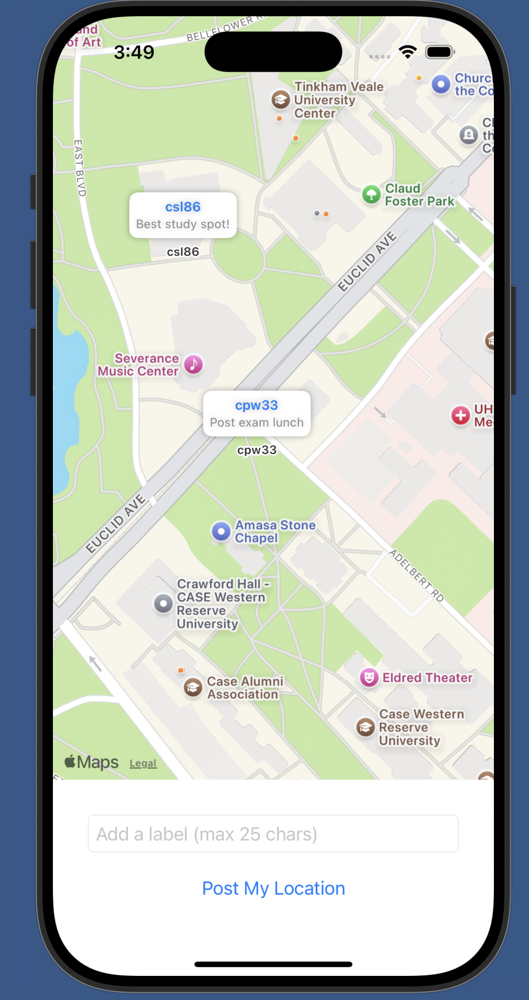
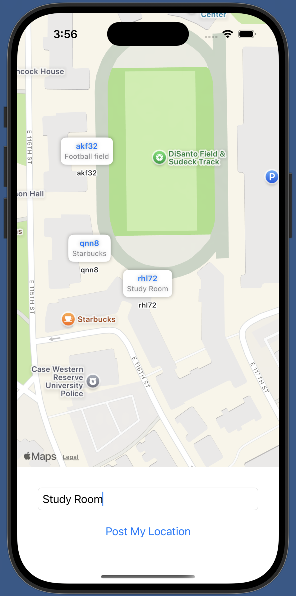

# CWRUPlaces

A modern **iOS 17** SwiftUI app demonstrating real-time location tracking, custom map annotations, and server-side integration. This project showcases best practices in **SwiftUI 5**, **Swift concurrency**, and Apple’s new **Observation** framework (`@Observable`).

---

## Overview

**CWRUPlaces** allows users to:
1. **View** a list of user locations on a map (fetched from a remote JSON endpoint).
2. **Post** their own location and an optional label back to the server.
3. **Automatically Refresh** the displayed locations every 30 seconds.
4. **Display** custom **star-shaped** map annotations (tap to reveal additional info).
5. **Center** the map on the user's current location as it updates.

> The app uses iOS 17’s new `@Observable` macro to eliminate `Combine` boilerplate. It also leverages SwiftUI’s enhanced `Map(position:)` to create fully customizable map experiences.

---

  
  

---

## Concepts Applied

- **iOS 17 & SwiftUI 5**: Demonstrates the cutting-edge features of Swift 5.9, including `@Observable` and updated `Map` APIs.
- **New Observation Framework**: Removes the need for `@Published` and `ObservableObject`, simplifying how SwiftUI detects data changes.
- **Map Annotations**: Showcases **custom** SwiftUI shapes (star pins), introduced in iOS 17’s refined `Annotation` API.
- **Location Management**: Integrates with `CoreLocation` for real-time GPS updates.
- **Server Communication**: Uses `URLSession` to both **fetch** and **post** data, with asynchronous completion.
- **UX Touches**: Smooth transitions, animations, and intuitive tap/expand behavior for map pins.

---

## Tech Stack & Highlights

1. **SwiftUI 5 (iOS 17)**
   - `Map(position:)` with `Annotation` for a new-level of map customization.
   - `@State` & `@Observable` for state management.
   - `.onChange(of:)` with the modern two-parameter or zero-parameter closures.

2. **Observation Framework**
   - `@Observable` in `LocationViewModel` and `LocationManager`.
   - Automatically updates SwiftUI views when properties change, no manual `objectWillChange.send()` required.

3. **Location Services**
   - `CLLocationManager` usage wrapped in a custom `LocationManager` class.
   - Requests user permission and updates user’s coordinates in real time.

4. **Networking**
   - Swift `URLSession` to communicate with the server endpoint (`https://caslab.case.edu/392/map.php`).
   - Automatic refresh every 30s (using `Timer`) to keep locations up-to-date.

5. **Custom Shapes & Annotations**
   - A custom `Star` shape for each user’s location pin.
   - Tappable pins that expand to show additional info (username, label, etc.).

6. **User Interaction**
   - Tap-to-expand annotation details (dynamic SwiftUI transitions).
   - Text field input for posting a custom label, limited to 25 characters.

---

